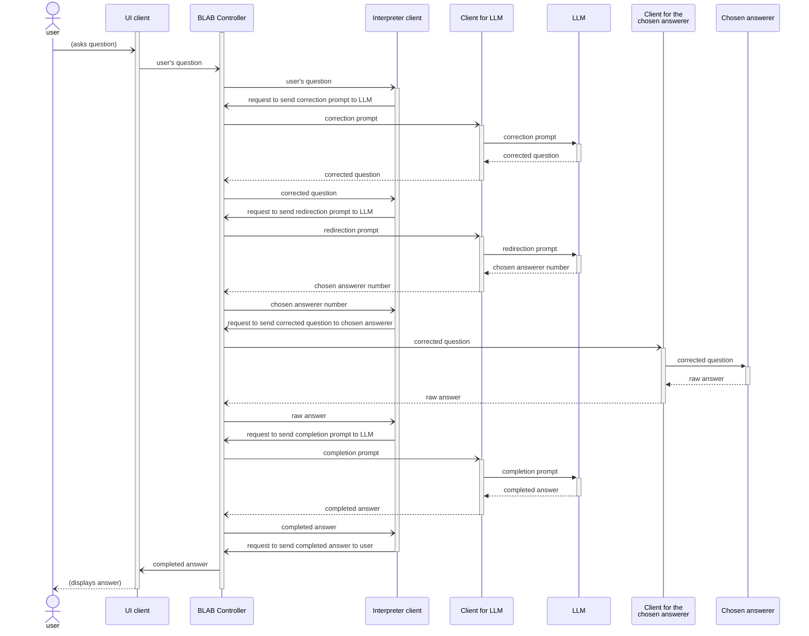

<!--
NOTE:
- On GitHub, the diagram should render automatically.
- On PyCharm, this diagram is rendered in the preview if you enable Mermaid support
  ("Settings" > "Languages and Frameworks" > "Markdown" > check "Mermaid").
-->

The controller delivers all messages back to the corresponding senders
(which clients can use to confirm that the controller received their messages),
but this has been omitted from the diagram to save space.
